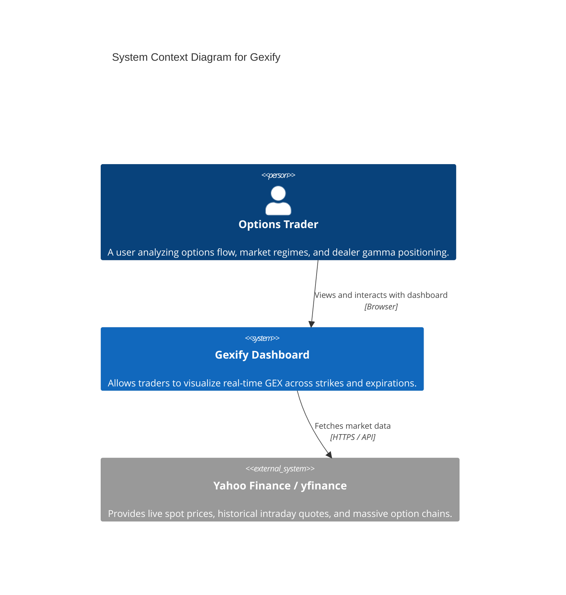
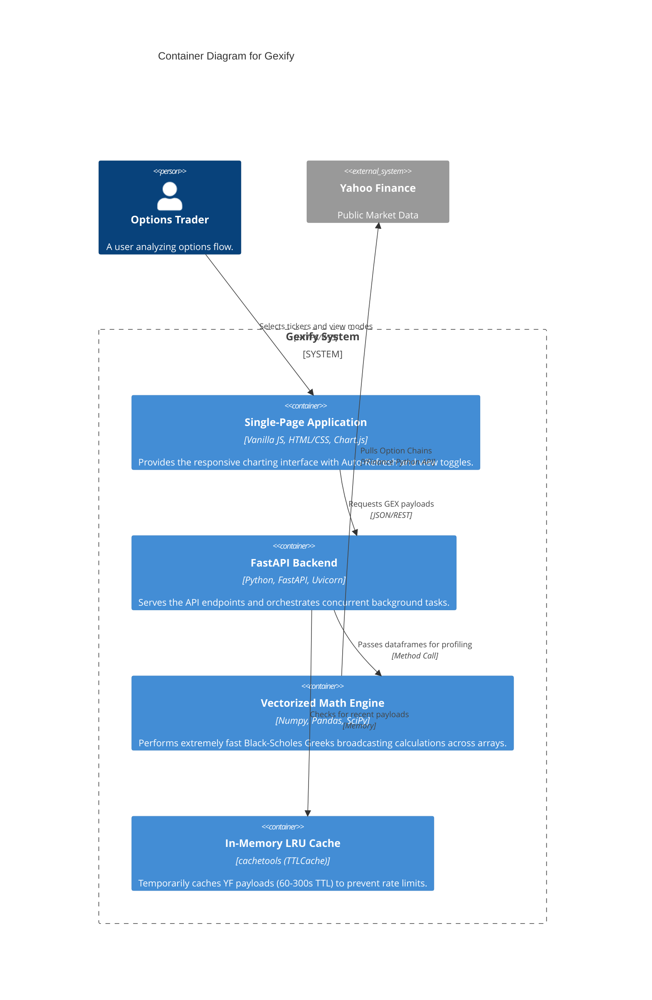
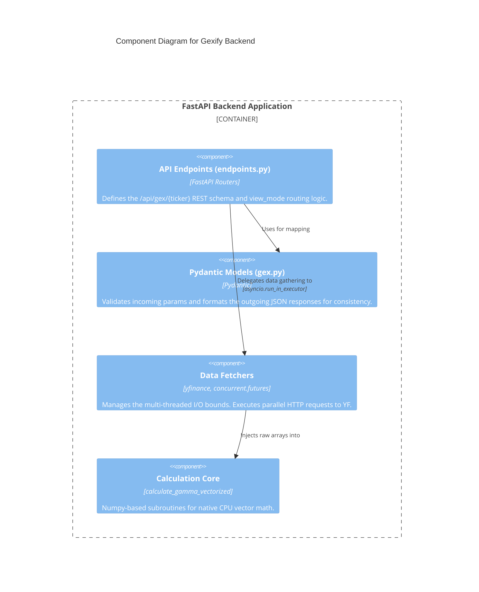
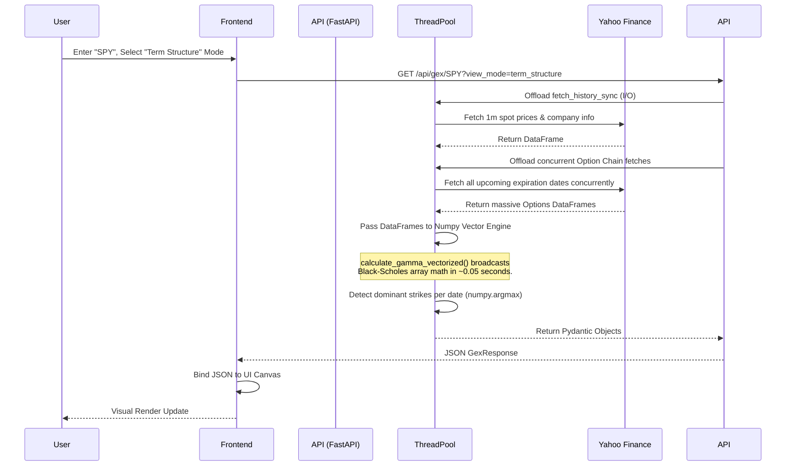

# Gexify Software Architecture

This document serves as the comprehensive architectural reference for **Gexify**, an interactive real-time options Gamma Exposure (GEX) profiler. 

It combines three industry-standard documentation paradigms to provide a complete, holistic picture of the system from different engineering perspectives:
1. **The C4 Model** (Context, Container, Component)
2. **The 4+1 View Model** (Logical, Process, Development, Physical, Scenarios)
3. **Architecture Decision Records (ADRs)** (Historical engineering trade-offs)

---

## Part 1: The C4 Model

The C4 model maps the static structure of the software, zooming from the highest-level external dependencies all the way down to the internal Python modules.

### 1.1 System Context (Level 1)

### 1.2 Container Diagram (Level 2)

### 1.3 Component Diagram (Level 3 - Backend)

---

## Part 2: The 4+1 View Model

The 4+1 model maps the system according to the distinct roles of the people building, deploying, and maintaining it.

### 2.1 Logical View (For Developers)
Focuses on the core business objects and domain entities.
- **Entities**: `GexDataPoint`, `GexResponse`, `ExpirationDetail`.
- **Domain Logic**: Standard Black-Scholes formula mapping implied volatility, strikes, and spot prices into Gamma values, which are then scaled into dollar-denominated Exposure calculations for Puts (negative) and Calls (positive).
- **Core Algorithms**: The GEX flip-level uses a cumulative sum zero-crossing array search.

### 2.2 Process View (For System Integrators)
Focuses on concurrency, synchronization, and runtime behavior.
- **FastAPI Event Loop**: The main asynchronous `uvicorn` loop handles all incoming HTTP/REST requests. 
- **ThreadPool Executor**: Because `yfinance` network requests and massive Pandas/Numpy array broadcasting natively block the CPU, they are banished to a standard OS ThreadPool using `asyncio.get_running_loop().run_in_executor()`. This cleanly separates I/O work from the event loop, ensuring the dashboard remains highly responsive to tens of thousands of concurrent clients.

### 2.3 Development View (For Programmers)
Focuses on the software management environment and module organization.
- **Package Manager**: Built entirely on Astral's `uv` for ultra-fast, deterministic dependency resolution (via `pyproject.toml` and `uv.lock`).
- **Structure**: Separation of concerns (`app/api/endpoints.py` for routing, `app/models/gex.py` for strictly-typed schemas, `app/services/gex_calculator.py` for math, `static/` for client assets).

### 2.4 Physical View (For DevOps)
Focuses on the topological layout and deployment infrastructure.
- **Compute**: A single commodity server or container running the `Uvicorn` ASGI server (port 8000). Highly horizontally scalable if deployed rigidly behind a round-robin load balancer.
- **External Hooks**: Frequent outbound HTTPS connections to Yahoo Finance APIs.

### 2.5 Scenarios (The +1 View)
Focuses on the actual user flows that tie the other 4 views together.

---

## Part 3: Architecture Decision Records (ADRs)

ADRs permanently document the *history* and *context* of highly specific engineering trade-offs made during the development lifecycle.

### ADR 001: Bypassing pure Python loops for NumPy Vectorization
* **Context**: Calculating Black-Scholes Greeks for major ETFs (like `SPY`) involves processing 5,000+ individual options contracts across dozens of expiration dates simultaneously.
* **Decision**: We replaced standard row-by-row `pandas.apply()` iterations with pure `numpy` array broadcasting natively allocated on the CPU.
* **Consequences**: Calculation times dropped from ~1.5 seconds to ~0.05 seconds. The system became significantly more scalable, enabling real-time entire-market aggregations (such as the Term Structure and Total Strikes views) without frontend timeout errors.

### ADR 002: In-Memory TTLCaching for External APIs
* **Context**: Yahoo Finance is prone to extreme rate-limiting and arbitrary latency spikes. Re-fetching the same massive option chain on every render would lock up the platform.
* **Decision**: Implemented Python's `cachetools` configured with a generic `TTLCache`.
* **Consequences**: Spot prices are cached for exactly 60 seconds (ensuring the dashboard remains "live" within acceptable trailing tolerances), while expensive multidimensional Option Chains are cached for 300 seconds. Subsequent latency dropped to ~0.02s per query.

### ADR 003: Vanilla JS over Heavy Javascript Frameworks
* **Context**: The frontend needed to be highly responsive, parse heavy JSON arrays, and render complex Chart.js canvases concurrently without visual stuttering.
* **Decision**: Decided *against* React, Vue, or Next.js, opting instead to write a single pure Vanilla Javascript file (`app.js`) performing direct DOM manipulations natively in the browser.
* **Consequences**: Zero required build steps. The frontend compiles essentially instantaneously across all devices, resulting in an incredibly tiny memory footprint and rapid iteration speeds.
