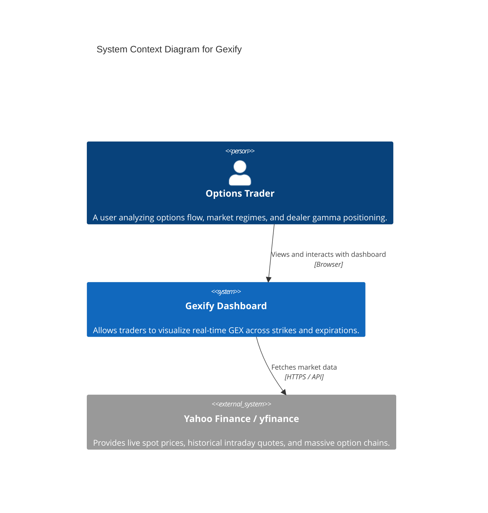
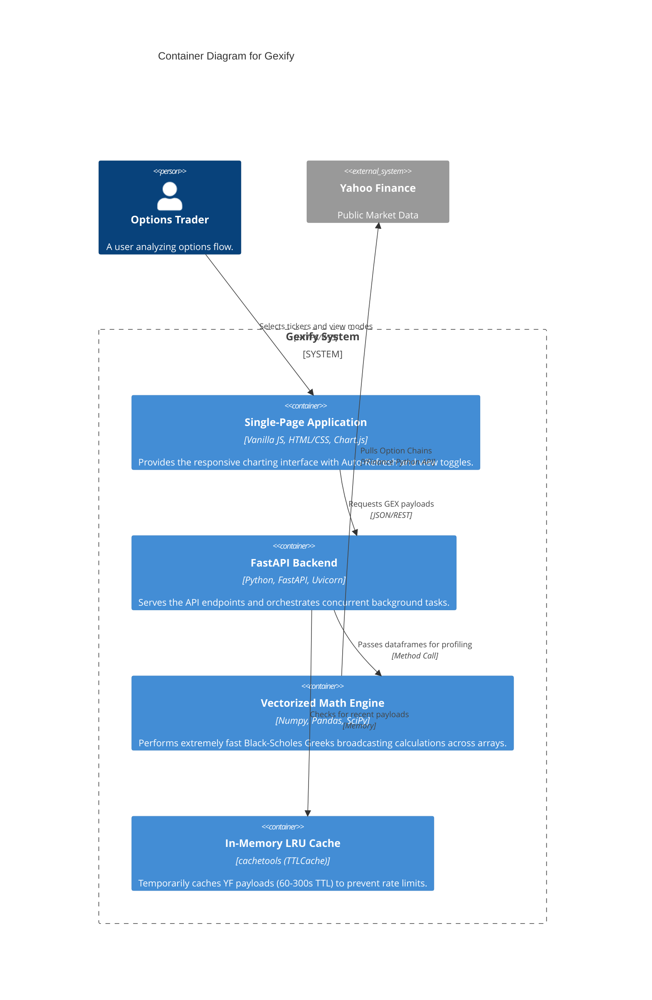
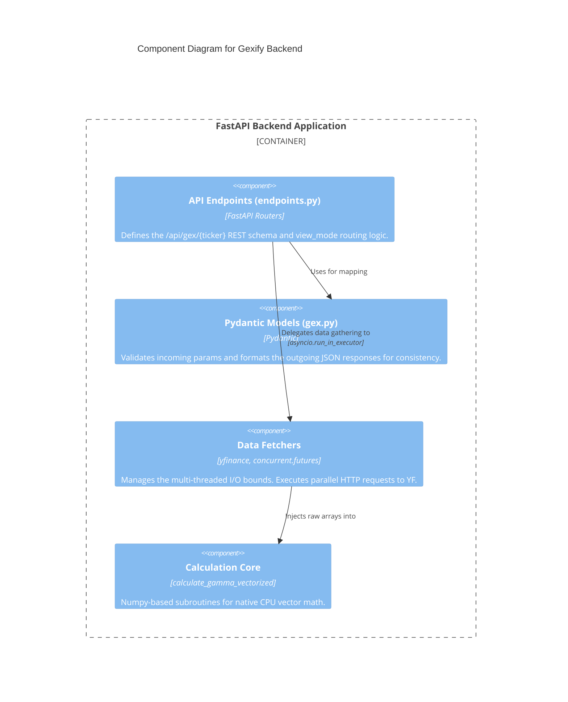
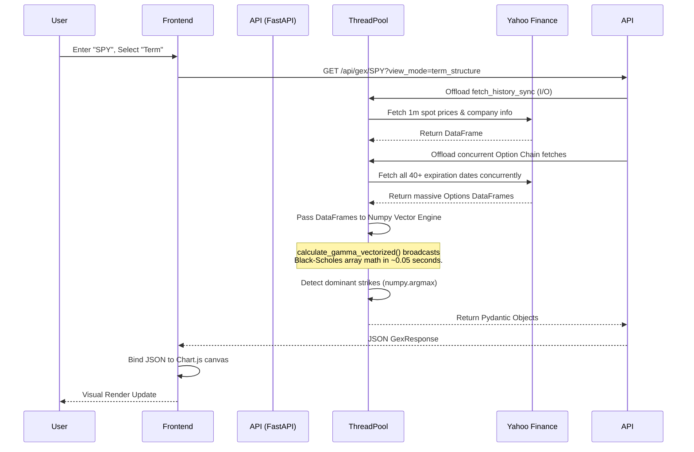

# Gexify Software Architecture

This document describes the high-level architecture of **Gexify**, an interactive dashboard for profiling Gamma Exposure (GEX) across equity and index option chains. It follows the [C4 Model](https://c4model.com/) approach for layered architectural representation.

---

## 1. System Context (Level 1)

The System Context diagram shows how Gexify fits into the broader ecosystem, identifying the users and external dependencies.

**Key Takeaways:**
* The system is fully self-contained on the user side.
* Gexify has no internal persistent database (e.g., PostgreSQL); it relies entirely on live external API fetching mapped into high-speed memory caches.

---

## 2. Container Diagram (Level 2)

The Container Diagram zooms into the `Gexify Dashboard` to show the high-level executable components.

**Key Architectural Decisions:**
* **Frontend**: Vanilla JS was chosen over React/Vue to eliminate build steps and reduce payload overhead. `Chart.js` is used for high-performance Canvas rendering of thousands of bars.
* **Backend**: `FastAPI` provides maximum async throughput.
* **Math Engine**: Because large ETFs like SPY have thousands of active contracts across 40+ expirations, `Numpy` vectorization is utilized to process Black-Scholes arrays on the CPU instantly, natively bypassing Python loops.

---

## 3. Component Diagram (Level 3 - Backend)

Zooming into the Python FastAPI container to see the structural breakdown of the business logic.

---

## 4. Sequence & Data Flow Analysis

This section visualizes the synchronous flow of data during a complex multi-expiration calculation (e.g., *Term Structure* mode). Note how the architecture prevents blocking the main event-loop.

### Technical Highlights
1. **Thread Pool Offloading**: `yfinance` is completely synchronous and blocking. If triggered natively on the FastAPI async event loop, a single 3-second YF timeout would block all other users on the dashboard. Gexify uses `asyncio.get_running_loop().run_in_executor(None, ...)` to banish all YF and Pandas overhead to separate OS threads.
2. **TTLCaching**: Options are heavily cached via `cachetools`. Spot prices expire in 60s (for intraday liveliness) while full massive chain aggregations expire in 300s.
3. **Argmax Injection**: For the Term Structure UI, instead of sending the massive 3D surface back to the browser to compute the "top contributor" strikes, the Pandas thread calculates the `argmax` for Call/Put gamma clusters locally and injects it statically into the payload.
