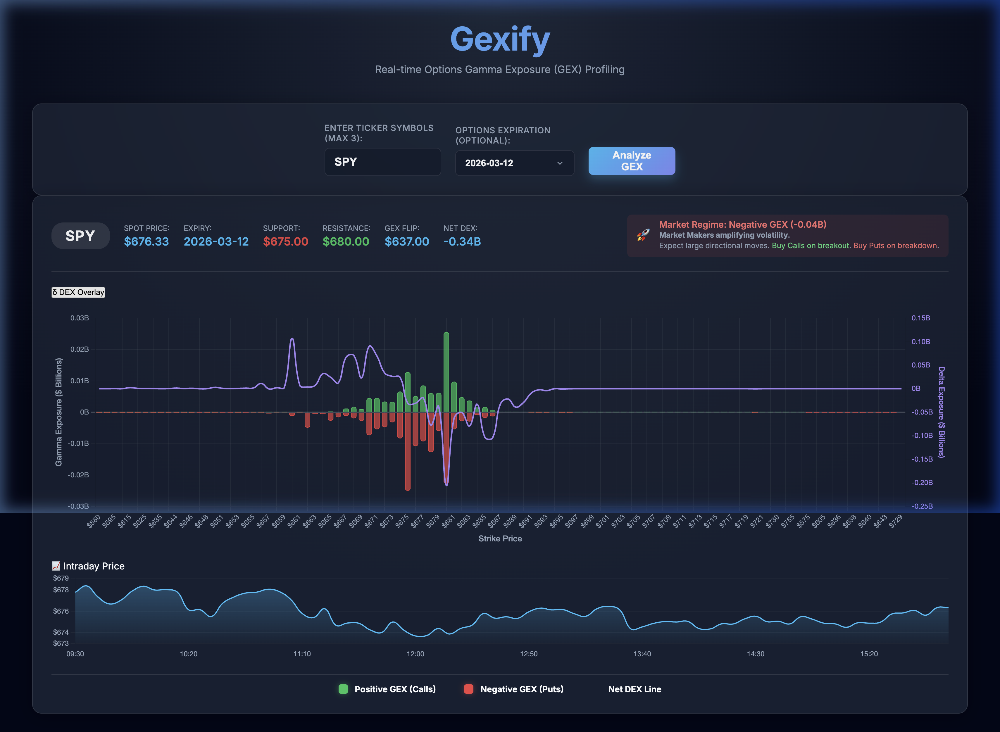

# Gexify 📊

**Real-time Options Gamma & Delta Exposure Profiler**

Gexify is a web tool for options traders that fetches live options chain data, calculates Gamma Exposure (GEX) and Delta Exposure (DEX) per strike using the Black-Scholes model, and visualizes them as interactive charts — helping you identify key support, resistance, flip levels, and market volatility regimes.

---

## ✨ Features

- **Live GEX Chart** — Bar chart of Call GEX (positive) vs Put GEX (negative) per strike, filtered to ±15% of spot on the backend for optimal performance
- **DEX Overlay** — Purple line showing net Delta Exposure per strike on a secondary Y-axis; togglable with the δ button
- **Spot Price Line** — Dashed white vertical line marking the current price on the chart
- **GEX Flip Level** — Cumulative GEX zero-crossing strike (dealer gamma reversal); shown as an orange dashed line + badge
- **DEX Flip Level** — Cumulative DEX zero-crossing strike (dealer delta reversal), returned alongside GEX flip
- **Net DEX Badge** — Aggregate delta exposure in billions, shown in the results header
- **Intraday Price Sparkline** — Full-day 5-min price bars rendered below the GEX chart for immediate price context
- **Support & Resistance Detection** — Auto-identifies the peak put GEX strike (support) and peak call GEX strike (resistance)
- **Market Regime Insight** — Positive GEX (low vol / range-bound) or Negative GEX (high vol / directional) signal
- **Term Structure Heatmap** — Expiration dropdown dynamically colors dates with Emojis (🔴/🟢) and displays exact Net GEX values in Billions, giving an instant macro-view of the options flow.
- **Auto-Refresh Toggle** — Keeps the dashboard live by silently polling background data every 60 seconds
- **Async Backend** — yfinance calls run in a thread pool executor so the FastAPI event loop is never blocked
- **Robust Error Handling & Validation** — Strict regex ticker validation, detailed API error messages, and graceful handling of closed-market periods
- **Fast In-Memory Caching** — Uses `TTLCache` to store expensive option chains for 60 seconds, preventing Yahoo Finance rate limits and dropping API response times to 0.02s.
- **Dark Glassmorphism UI** — Clean, modern dark-mode interface built with vanilla JS + CSS featuring smooth fade-in animations

---

## 📸 Screenshot

> **SPY analysis** — Spot: $676.33 | Expiry: 2026-03-12 | GEX Flip: $637.00 | Net DEX: −0.34B | Regime: 🚀 Negative GEX



*The purple DEX line overlays the GEX bars on a secondary right Y-axis. The intraday sparkline below shows the full trading day price action.*

---

## 🧮 How GEX & DEX Are Calculated

Both measures use **Black-Scholes** Greeks, scaled to dollar exposure:

```
GEX per strike:
  Γ = N'(d1) / (S × σ × √T)
  Call GEX = Γ × OI × 100 × Spot
  Put  GEX = Γ × OI × 100 × Spot × (−1)   ← negative by convention

DEX per strike:
  Call Δ = N(d1)          ∈ (0, 1)    ← always positive
  Put  Δ = N(d1) − 1      ∈ (−1, 0)   ← always negative
  Call DEX = Δ × OI × 100 × Spot
  Put  DEX = Δ × OI × 100 × Spot

where:
  d1  = [ln(S/K) + (r + 0.5σ²)T] / (σ√T)
  S   = Spot Price  |  K = Strike  |  T = Time to expiry (years)
  r   = Risk-free rate (4%)  |  σ = Implied Volatility
  OI  = Open Interest  |  100 = standard US contract multiplier
```

**Flip levels** are computed by sorting strikes, taking the cumulative sum of Total GEX (or Total DEX), and finding the first strike where the running total changes sign.

---

## 🗂️ Project Structure

```
gexify/
├── app/
│   ├── main.py                    # FastAPI app setup, CORS, static mount
│   ├── api/
│   │   └── endpoints.py           # API routes (async executor wrappers)
│   ├── models/
│   │   └── gex.py                 # Pydantic models: GexDataPoint, DexDataPoint, GexResponse
│   └── services/
│       └── gex_calculator.py      # Black-Scholes gamma/delta + yfinance pipeline
├── static/
│   ├── index.html                 # Single-page frontend
│   ├── app.js                     # Chart.js rendering, DEX overlay, sparkline
│   └── styles.css                 # Dark glassmorphism theme
├── pyproject.toml                 # Python dependencies (uv)
└── main.py                        # Root entry point
```

---

## 🚀 Getting Started

### Prerequisites

- Python 3.13+
- [`uv`](https://docs.astral.sh/uv/) package manager

### Installation & Run

```bash
# Clone the repo
git clone https://github.com/vikbht/gexify.git
cd gexify

# Install dependencies
uv sync

# Start the server
uv run uvicorn app.main:app --reload
```

Then open [http://localhost:8000](http://localhost:8000) in your browser.

---

## 🔌 API Endpoints

| Method | Endpoint | Description |
|--------|----------|-------------|
| `GET` | `/api/gex/{ticker}/expirations` | List available options expiration dates |
| `GET` | `/api/gex/{ticker}?expiration=YYYY-MM-DD` | Full GEX + DEX profile for a ticker |

### Example Response Fields

```jsonc
{
  "ticker": "SPY",
  "spot_price": 676.33,
  "gex_data": [{ "strike": 675, "call_gex": 1.2e9, "put_gex": -0.8e9, "total_gex": 0.4e9 }],
  "dex_data": [{ "strike": 675, "call_dex": 9.1e9, "put_dex": -4.0e6, "total_dex": -4.0e6 }],
  "historical_prices": [{ "date": "09:30", "price": 678.1 }],
  "gex_flip_strike": 637.0,
  "dex_flip_strike": 685.0
}
```

---

## 📦 Tech Stack

| Layer | Technology |
|-------|-----------|
| Backend | FastAPI, Uvicorn |
| Data | yfinance, pandas, numpy, scipy |
| Models | Pydantic v2 |
| Frontend | Vanilla JS, Chart.js |
| Styling | Vanilla CSS (Glassmorphism) |
| Package Mgmt | `uv` |

---

## 📖 Reading the Chart

| Signal | Meaning |
|--------|---------|
| 🟢 **Positive GEX (green bars)** | Call gamma — dealers hedge by selling rallies (suppresses upside) |
| 🔴 **Negative GEX (red bars)** | Put gamma — dealers hedge by buying dips (amplifies downside) |
| **Purple DEX line** | Net dealer delta exposure per strike — directional hedging pressure |
| **Dashed white line** | Current spot price |
| **Dashed orange line** | GEX flip level — cumulative gamma changes sign here |
| **Support badge** | Strike with the largest put GEX concentration |
| **Resistance badge** | Strike with the largest call GEX concentration |
| **GEX Flip badge** | Where cumulative GEX = 0; below spot → bearish lean, above → bullish |
| **Net DEX badge** | Aggregate dealer delta in billions; negative = dealers net short delta |
| 🛡️ **Positive GEX Regime** | Total GEX > 0 → vol suppressed → range-bound / choppy |
| 🚀 **Negative GEX Regime** | Total GEX < 0 → vol amplified → expect large directional moves |
| 📈 **Intraday Sparkline** | Full-day 5-min price bars — puts the GEX/DEX profile in price context |
| ⏱️ **Auto-Refresh Toggle** | When enabled, silently updates the backend data every 60 seconds |
| 🔥 **Term Structure Heatmap** | Shows the Net GEX value in Billions for the next 30+ expiration dates in the dropdown |

---

## ⚠️ Disclaimer

This tool is for **educational and informational purposes only**. It does not constitute financial advice. Always do your own research before making any trading decisions.
