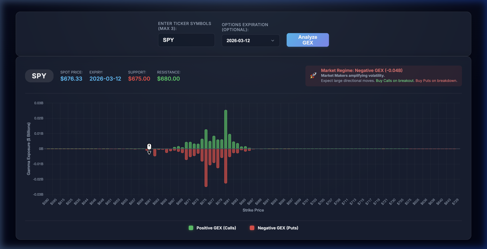

# Gexify

**Real-time Options Gamma Exposure (GEX) Profiler**

Gexify is a web tool for options traders that fetches live options chain data, calculates Gamma Exposure (GEX) per strike price using the Black-Scholes model, and visualizes it as an interactive chart — helping you identify key support, resistance levels, and market volatility regimes.

---

## Features

- **Live GEX Chart** — Stacked bar chart of Call GEX (positive) vs Put GEX (negative) per strike, filtered to ±15% of the current spot price
- **Spot Price Line** — Dashed vertical line showing the current price overlaid on the chart
- **Support & Resistance Detection** — Automatically identifies the strike with the highest put GEX (support) and call GEX (resistance)
- **Market Regime Insight** — Classifies the market as Positive GEX (low vol/choppy) or Negative GEX (high vol/trending)
- **Expiration Picker** — Dynamically loads all available options expiration dates for any ticker
- **Dark Glassmorphism UI** — Modern dark-mode interface built with vanilla JS and CSS

---

## Demo

> **Live analysis of SPY** — Spot: $676.33 | Expiry: 2026-03-12 | Regime: Negative GEX (-0.04B)



*The chart shows Call GEX (green bars) vs Put GEX (red bars) per strike price. The dashed white vertical line marks the current spot price. Support ($675) and Resistance ($680) are auto-detected from peak GEX concentrations.*

---

## Table of Contents

1. [Getting Started](#getting-started)
2. [Using the Application](#using-the-application)
3. [Reading the Chart](#reading-the-chart)
4. [Software Architecture](#software-architecture)
5. [API Reference](#api-reference)
6. [GEX Calculation](#gex-calculation)
7. [Tech Stack](#tech-stack)
8. [Configuration](#configuration)
9. [Disclaimer](#disclaimer)

---

## Getting Started

### Prerequisites

- Python 3.13+
- [`uv`](https://docs.astral.sh/uv/) package manager

Install `uv` if you don't have it:

```bash
pip install uv
# or on macOS/Linux
curl -LsSf https://astral.sh/uv/install.sh | sh
```

### Installation

```bash
# Clone the repo
git clone <repo-url>
cd gexify

# Install dependencies
uv sync
```

### Running the Server

```bash
# Development (with hot reload)
uv run uvicorn app.main:app --reload

# Production-like
uv run uvicorn app.main:app --host 0.0.0.0 --port 8000
```

Then open [http://localhost:8000](http://localhost:8000) in your browser.

---

## Using the Application

### Step 1: Enter a Ticker

Type a stock or ETF ticker symbol (e.g., `SPY`, `AAPL`, `QQQ`) in the input field. When you click away from the field (on blur), Gexify automatically fetches all available options expiration dates for that ticker and populates the expiration dropdown.

### Step 2: Select an Expiration Date

Choose an expiration date from the dropdown. The dropdown is pre-populated with every available expiry. If you leave it on the default, Gexify will use the nearest upcoming expiration.

Changing the expiration date will automatically trigger a new chart analysis without needing to click "Analyze GEX" again.

### Step 3: Analyze

Click the **Analyze GEX** button (or let the auto-trigger from Step 2 run). The app will:

1. Fetch live intraday prices to get the current spot price
2. Pull the full options chain for the selected expiration
3. Calculate Black-Scholes gamma for every strike
4. Compute dollar-denominated GEX per strike
5. Render the results

### Step 4: Interpret the Results

Once loaded, the results panel shows:

| Badge | Description |
|-------|-------------|
| **Ticker** | The symbol analyzed |
| **Spot Price** | Current market price (from 5-minute intraday bars) |
| **Expiry** | The expiration date used for the options chain |
| **Support** | Strike with the largest negative (put) GEX concentration |
| **Resistance** | Strike with the largest positive (call) GEX concentration |
| **Regime Banner** | Whether total GEX is positive (low vol) or negative (high vol) |

---

## Reading the Chart

The chart displays GEX in **billions of dollars** per strike price, filtered to ±15% around the current spot price.

| Element | Meaning |
|---------|---------|
| **Green bars (positive)** | Call GEX — at these strikes, market makers delta-hedge by selling into rallies, suppressing upside moves |
| **Red bars (negative)** | Put GEX — at these strikes, market makers delta-hedge by buying dips, amplifying downside moves |
| **Dashed white line** | Current spot price |
| **Support badge** | Strike with peak put GEX — acts as a floor because MM buying increases here |
| **Resistance badge** | Strike with peak call GEX — acts as a ceiling because MM selling increases here |

### Market Regime

| Regime | Total GEX | What to Expect |
|--------|-----------|----------------|
| **Positive GEX** | > 0 | Market makers are net long gamma. They sell rallies and buy dips to hedge, suppressing volatility. Price tends to be range-bound and choppy. |
| **Negative GEX** | < 0 | Market makers are net short gamma. They must chase price to hedge, amplifying moves in both directions. Expect large directional swings. |

---

## Software Architecture

### Overview

Gexify is a lightweight full-stack application with a FastAPI backend and a vanilla JavaScript single-page frontend. The backend handles data fetching and all financial calculations; the frontend is responsible only for rendering and user interaction.

```
Browser (SPA)
    │
    │  HTTP (JSON)
    ▼
FastAPI Backend
    │
    ├── /api/gex/{ticker}/expirations
    └── /api/gex/{ticker}?expiration=YYYY-MM-DD
            │
            ▼
    GEX Calculator Service
            │
            ├── yfinance  →  spot price (5m intraday bars)
            └── yfinance  →  options chain (calls + puts)
                            │
                            ▼
                    Black-Scholes Gamma
                            │
                            ▼
                    GEX = Γ × OI × 100 × Spot
```

### Directory Structure

```
gexify/
├── app/
│   ├── main.py                    # FastAPI app setup, CORS, static file mount
│   ├── api/
│   │   └── endpoints.py           # Route handlers
│   ├── models/
│   │   └── gex.py                 # Pydantic request/response models
│   └── services/
│       └── gex_calculator.py      # Black-Scholes gamma + yfinance pipeline
├── static/
│   ├── index.html                 # SPA shell
│   ├── app.js                     # Event handling, API calls, Chart.js rendering
│   └── styles.css                 # Dark glassmorphism theme
├── pyproject.toml                 # Dependencies and metadata (uv)
└── main.py                        # Root entry point
```

### Backend

**`app/main.py`** — Creates the FastAPI application, configures CORS (all origins, permissive for development), registers the API router under the `/api` prefix, and mounts the `static/` directory so the frontend is served from `/`.

**`app/api/endpoints.py`** — Two route handlers with input validation and structured error responses. Normalizes tickers to uppercase and delegates all business logic to the service layer.

**`app/models/gex.py`** — Pydantic v2 models for API responses:
- `GexDataPoint` — `{strike, call_gex, put_gex, total_gex}`
- `HistoricalPriceItem` — `{date, price}` (reserved for sparklines)
- `GexResponse` — Full response envelope with status and message
- `ExpirationResponse` — List of available expiration strings

**`app/services/gex_calculator.py`** — The core calculation pipeline (described in detail in [GEX Calculation](#gex-calculation)).

### Frontend

The frontend is a single-page application with no build step and no JavaScript framework.

**`static/index.html`** — Static HTML shell with a control panel (ticker input, expiration select, submit button) and a results panel that is hidden until data is loaded.

**`static/app.js`** — ~370 lines handling:
- Ticker blur → fetch expirations → populate dropdown
- Expiration change → auto-submit form
- Form submit → fetch GEX → render results
- `renderChart(data)` — filters strikes to ±15% of spot, finds support/resistance peaks, calculates regime
- `renderGexChart(...)` — creates Chart.js stacked bar instance with custom spot-price-line plugin, tooltips in billions, dark theme

**`static/styles.css`** — ~440 lines of vanilla CSS with glassmorphism (backdrop blur, semi-transparent panels), dark background (`#0f172a`), cyan/indigo gradient header, and responsive breakpoints.

### Data Flow

```
1. User enters ticker (blur)
   └─ GET /api/gex/{ticker}/expirations
        └─ yfinance.Ticker(ticker).options
        └─ Return {ticker, expirations[], status}
        └─ Populate <select> dropdown

2. User clicks "Analyze GEX"
   └─ GET /api/gex/{ticker}?expiration=YYYY-MM-DD
        ├─ Fetch 1-day 5m bars → most recent close = spot price
        ├─ Resolve expiration (user selection or nearest)
        ├─ Fetch option_chain(expiration) → calls DataFrame, puts DataFrame
        ├─ For each strike in calls:
        │    T = (expiry - today) / 365.25
        │    d1 = [ln(S/K) + (r + 0.5σ²)T] / (σ√T)
        │    γ = N'(d1) / (S × σ × √T)
        │    call_gex = γ × OI × 100 × S
        ├─ For each strike in puts:
        │    put_gex = γ × OI × 100 × S × (-1)
        ├─ Outer join calls + puts on strike, fill missing = 0
        └─ Return {ticker, spot_price, expiration, gex_data[]}

3. Frontend processes response
   ├─ Filter gex_data to spot ± 15%
   ├─ Find support = argmax(put_gex), resistance = argmax(call_gex)
   ├─ Compute total_gex = sum of all total_gex in range
   ├─ Render Chart.js bar chart with spot line overlay
   └─ Show regime insight banner
```

---

## API Reference

### GET `/api/gex/{ticker}/expirations`

Returns all available options expiration dates for a ticker.

**Path params**
- `ticker` — Stock symbol (e.g., `SPY`, `AAPL`). Case-insensitive.

**Response**
```json
{
  "ticker": "SPY",
  "expirations": ["2025-03-21", "2025-03-28", "2025-04-04"],
  "status": "success",
  "message": null
}
```

**Example**
```bash
curl http://localhost:8000/api/gex/SPY/expirations
```

---

### GET `/api/gex/{ticker}`

Returns the full GEX profile for a ticker and expiration.

**Path params**
- `ticker` — Stock symbol. Case-insensitive.

**Query params**
- `expiration` *(optional)* — Target expiration date in `YYYY-MM-DD` format. Defaults to the nearest available expiry.

**Response**
```json
{
  "ticker": "SPY",
  "spot_price": 676.33,
  "expiration_date": "2025-03-21",
  "gex_data": [
    {"strike": 670.0, "call_gex": 1234567.0, "put_gex": -987654.0, "total_gex": 246913.0},
    ...
  ],
  "historical_prices": [],
  "status": "success",
  "message": null
}
```

**Example**
```bash
# Nearest expiration
curl http://localhost:8000/api/gex/SPY

# Specific expiration
curl "http://localhost:8000/api/gex/SPY?expiration=2025-04-17"
```

---

## GEX Calculation

### Black-Scholes Gamma

Gamma (Γ) measures how fast an option's delta changes with respect to the underlying price. Market makers who sell options must continuously delta-hedge; the gamma of their position determines how aggressively they must buy or sell the underlying.

```
d1 = [ln(S/K) + (r + 0.5σ²) × T] / (σ × √T)

Γ = N'(d1) / (S × σ × √T)

where:
  S  = Spot Price (current underlying price)
  K  = Strike Price
  T  = Time to expiration in years
  r  = Risk-free rate (4%)
  σ  = Implied Volatility (from the options chain)
  N' = Standard normal probability density function
```

### Dollar-Denominated GEX

Raw gamma is converted to a dollar-denominated exposure that represents the notional hedging flow per 1% move in the underlying:

```
Call GEX =  Γ × Open Interest × 100 × Spot
Put GEX  = -Γ × Open Interest × 100 × Spot
```

The `100` multiplier accounts for the standard US equity options contract size (100 shares per contract). Puts are negated by convention because market makers who sold puts are short gamma — they must buy the underlying as it falls, amplifying downward moves.

### Edge Cases

| Scenario | Handling |
|----------|----------|
| Implied volatility = 0 | Returns gamma = 0 (skips calculation) |
| Same-day expiration | T clamped to 0.001 years (prevents division by zero) |
| Strike missing from one side | Filled with 0 GEX on that side (outer join) |
| No options data returned | Returns structured error response with `status: "error"` |

---

## Tech Stack

| Layer | Technology | Version |
|-------|-----------|---------|
| Backend framework | FastAPI | >=0.133 |
| ASGI server | Uvicorn | >=0.41 |
| Data fetching | yfinance | >=1.2 |
| Numerical computing | pandas, numpy, scipy | latest |
| Data validation | Pydantic v2 | >=2.12 |
| Frontend | Vanilla JavaScript | ES2020+ |
| Charting | Chart.js | CDN (v4) |
| Styling | Vanilla CSS | — |
| Package manager | uv | — |
| Python version | 3.13+ | — |

---

## Configuration

There are no environment variables required. The following constants are hardcoded and can be changed directly in the source:

| Constant | Location | Default | Description |
|----------|----------|---------|-------------|
| Risk-free rate (`r`) | `app/services/gex_calculator.py` | `0.04` | Used in Black-Scholes d1 formula |
| Contract multiplier | `app/services/gex_calculator.py` | `100` | Standard US equity option contract size |
| Chart filter range | `static/app.js` | `0.15` (±15%) | Fraction of spot price used to filter strikes |
| CORS origins | `app/main.py` | `["*"]` | Allow all origins (change for production) |

---

## Disclaimer

This tool is for **educational and informational purposes only**. It does not constitute financial advice. Options trading involves significant risk of loss. Always conduct your own research before making any trading decisions.
